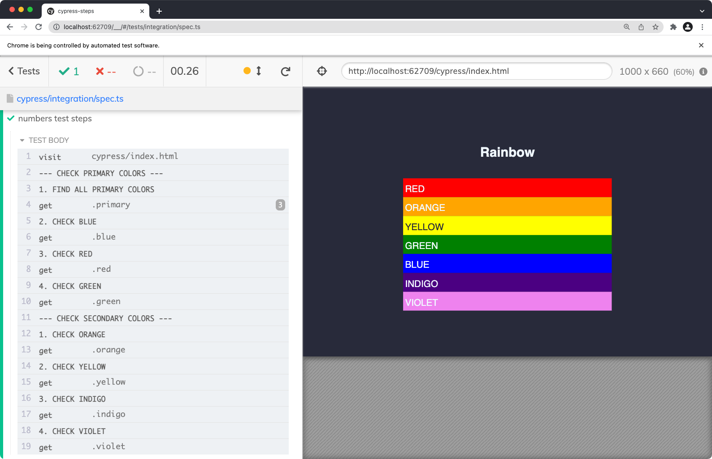

## Cypress steps

A small Cypress plugin that will add helper logging commands to your test flow. 

### cy.step()
If you like to add `cy.log()` commands to your test to create a test scenario, this plugin does exactly that, but in addition, will add numbering to your tests:

```ts
it('numbers test steps', () => {

  cy.step('open a page')
  cy.visit('cypress/index.html')

  cy.step('find all primary colors')
  cy.get('.primary')

  cy.step('select blue')
  cy.get('.blue')

});
```


### Error messages
If your test fails, your scenario will be added to the error message. This way your scenario will be visible right on the error screenshot that Cypress does automatically:


### cy.section()
Works similarly to `cy.step()` but will be more prominent in Cypress runner (adding '---' to the log message) and will reset counter. This way you can divide your test into multiple secions. Alternatively, you can also use `cy.step('log message', { section: true }`)

