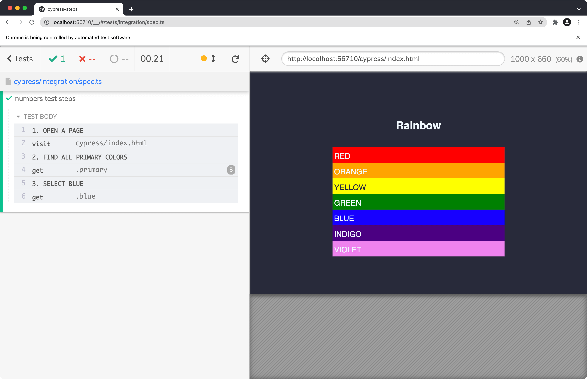
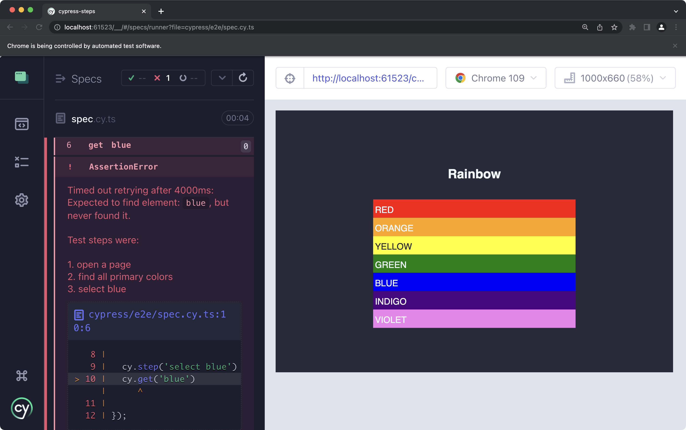
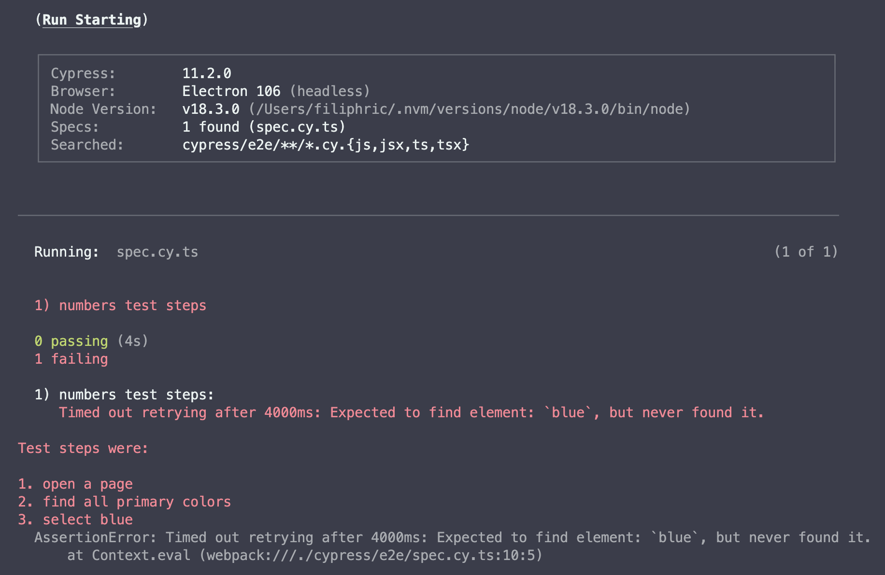
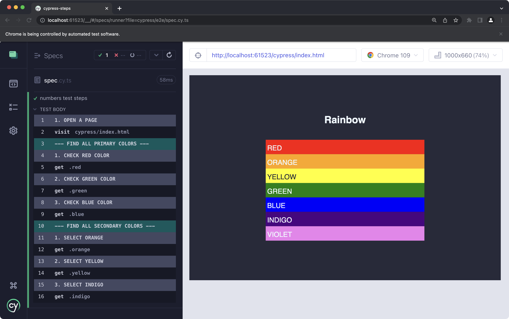

<h2 align=center>Cypress Steps plugin</h2>
<p align="center">
<a href="https://github.com/sponsors/filiphric"></a>
</p>

<p align="center">
A small Cypress helper that adds your test steps to the timeline and error logs.
</p>

### Table of contents
- [Installation](#installation)
- [Usage](#usage)
- [cy.step()](#cystep)
- [cy.section()](#cysection)
- [TIP: rename all your cy.log() to cy.step() commands](#tip-rename-all-your-cylog-to-cystep-commands)

### Installation

Install this package:
```bash
npm i cypress-plugin-steps
# or
yarn add cypress-plugin-steps
```

Import the plugin into your `cypress/support/e2e.js` file:
```js
import 'cypress-plugin-steps'
// or
require('cypress-plugin-steps')
```
### TypeScript support
In most cases, types work just by installing plugin, but you can add the types to your `tsconfig.json`
```json
{
  "types": ["cypress-plugin-steps"]
}
```
This will add types for `cy.step()` and `cy.section()` command.

### Usage
This will add two new commands to your Cypress library: `cy.step()` and `cy.section()` See the details below

### cy.step()
This works similarly to `cy.log()` command, but in addition, will add numbering to your tests:

```ts
it('numbers test steps', () => {

  cy.step('open a page')
  cy.visit('cypress/index.html')

  cy.step('find all primary colors')
  cy.get('.primary')

  cy.step('select blue')
  cy.get('.blue')

});
```



### Error messages
If your test fails, your scenario will be added to the error message. This way your scenario will be visible right on the error screenshot that Cypress does automatically:



You can also see the scenario in terminal:


### cy.section()
Works similarly to `cy.step()` but will be more prominent in Cypress runner (adding '---' to the log message) and will reset counter. This way you can divide your test into multiple secions. 



### TIP: rename all your `cy.log()` to `cy.step()` commands

You can find and replace all your `cy.log()` commands by matching the word `log` with following regex:
```
(?:cy\s*)?log\s*
```

<hr>
<p align="center">
...powered by coffee and love ❤️  <a href="https://filiphric.com">Filip Hric
</p>